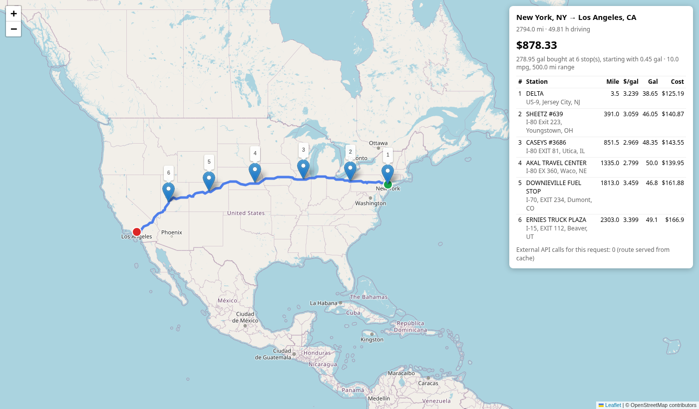

# Fuel Route Planner API

A Django REST API that takes a start and finish anywhere in the USA and returns
the driving route, where to buy fuel along it, and what the fuel for the trip
will cost. The truck has a 500-mile range and does 10 miles per gallon. Prices
come from the supplied `fuel-prices-for-be-assessment.csv`.

- **One external call per new trip.** Routing is a single OSRM request.
  "City, ST" endpoints are geocoded offline, and a repeated trip is served from
  a cache with 0 calls.
- **Fast.** A new cross-country trip takes about 0.5–1 s, almost all of it the
  OSRM request. A repeated trip takes 5–45 ms.
- **Cheapest fuel, without silly stops.** It uses a provably optimal refuelling
  algorithm plus a cost per stop, so it won't stop for a quarter gallon to save
  two cents.

```
GET /api/route/?start=Chicago, IL&finish=Dallas, TX
```



## Quick start

Requires Python 3.12+ (Django 6.1).

```bash
python -m venv .venv && source .venv/bin/activate
pip install -r requirements.txt
python manage.py migrate
python manage.py load_stations        # loads 6,626 US stations, about 2 s
python manage.py runserver
```

Then open http://127.0.0.1:8000/api/route/map/?start=New%20York,%20NY&finish=Los%20Angeles,%20CA
or import `postman/fuel-route.postman_collection.json` into Postman.

Run the tests with `python manage.py test`. They don't touch the network.

## API

### `GET /api/route/` or `POST /api/route/`

| Parameter | Default | Meaning |
|---|---|---|
| `start`, `finish` | required | `"City, ST"`, `"City, State"` (a ZIP is fine), `"lat,lon"`, or a street address in the USA |
| `start_fuel_percent` | leave empty | Tank level when the truck leaves (0–100). If empty, the truck leaves with just enough fuel to reach the first station, so the total covers the whole trip |
| `stop_cost_usd` | `25` | What one fuel stop costs in time off the road. `0` gives the pure cheapest-fuel plan |
| `include_geometry` | `true` | Include the route line as GeoJSON |

GET takes query parameters. POST takes the same fields as a JSON body.

Response, trimmed (`include_geometry=false`):

```json
{
  "start":  {"query": "Chicago, IL", "resolved_as": "Chicago city, IL", "lat": 41.87556, "lon": -87.62442, "source": "census_gazetteer"},
  "finish": {"query": "Dallas, TX",  "resolved_as": "Dallas city, TX",  "lat": 32.77627, "lon": -96.79686, "source": "census_gazetteer"},
  "route":  {"distance_miles": 966.9, "duration_hours": 17.1},
  "fuel_stops": [
    {"stop": 1, "mile": 0.0, "name": "Gas N Wash", "address": "I-55, EXIT 285", "city": "Chicago", "state": "IL",
     "price_per_gallon": 3.399, "gallons": 48.0, "cost_usd": 163.15, "fuel_on_arrival_gallons": 0.1, "...": "..."},
    {"stop": 2, "mile": 481.0, "name": "SHELL", "address": "I-55, EXIT 48", "city": "Osceola", "state": "AR",
     "price_per_gallon": 2.999, "gallons": 48.59, "cost_usd": 145.73, "fuel_on_arrival_gallons": 0.0,
     "approx_miles_off_route": 3.3, "lat": 35.69022, "lon": -89.98829, "opis_id": 64617}
  ],
  "summary": {
    "total_fuel_cost_usd": 308.88, "gallons_purchased": 96.59, "number_of_stops": 2,
    "trip_gallons_burned": 96.69, "start_fuel_gallons": 0.1, "fuel_at_arrival_gallons": 0.0,
    "average_price_paid_per_gallon": 3.198,
    "assumptions": {"mpg": 10.0, "max_range_miles": 500.0, "tank_gallons": 50.0, "stop_cost_usd": 25.0,
                    "start_fuel": "just enough to reach the first station on the route; all other fuel is bought"}
  },
  "map_url": "http://127.0.0.1:8000/api/route/map/?start=Chicago%2C+IL&finish=Dallas%2C+TX&stop_cost_usd=25.0",
  "meta": {"external_api_calls": 0, "external_api_calls_detail": [], "route_from_cache": true,
           "stations_considered": 172, "compute_ms": 18.3}
}
```

`meta.external_api_calls` reports how many third-party requests this call made.

Errors:

| Status | When |
|---|---|
| 400 | Bad input, or a location outside the USA |
| 422 | No road route between the points (Hawaii to the mainland, say), or a stretch longer than the range with no station; the response includes the gap |
| 502 | The routing or geocoding service is down |

### `GET /api/route/map/`

Takes the same parameters and returns the plan drawn on an OpenStreetMap map
(Leaflet), with a stop table. Every JSON response links to it in `map_url`.

## How it works

```
start, finish ──► "City, ST": Census Gazetteer, offline ─────► 0 API calls
                  street address: one Nominatim search ───────► 1 API call
                         │
                         ▼
              OSRM route (cached on disk) ─────────────────────► 1 API call per new trip
                         │
                         ▼
     match stations to the route (KD-tree, 10-mile corridor, highway check)
                         │
                         ▼
     choose stops (DP: fuel cost + cost per stop) ──► buy amounts (exact greedy)
```

1. **Station coordinates.** The price list has a town and state but no
   coordinates. `load_stations` matches each town against the US Census
   Gazetteer (49k places, shipped in `data/us_places.csv`). That covers 97.4%
   of stations. The remaining 128 unincorporated towns, such as Breezewood PA,
   were geocoded once with Nominatim and committed in
   `data/geocode_overrides.csv`. Every US station has a coordinate, and the API
   never geocodes a station at request time. The 620 Canadian rows are skipped.
   Rows that repeat an OPIS ID keep the cheapest price.
2. **Endpoints.** `"City, ST"` resolves from the same Gazetteer. For about 500
   large cities, the Census "internal point" is replaced by the real centre
   (`data/city_centres.csv`); San Francisco's internal point is otherwise in the
   Pacific. Street addresses fall back to one Nominatim search. Coordinates must
   fall inside the Census 1:5M outline of the USA (`data/us_boundary.json`),
   which rejects Tijuana, Windsor and Vancouver but keeps waterfront points.
3. **Route.** OSRM returns the full geometry, the length, and the highway of
   every step in one call (`overview=full&geometries=polyline6&steps=true`).
   The parsed route is cached for 7 days in Django's file cache, keyed by both
   coordinates.
4. **Stations along the route.** The route is resampled every 0.5 miles and
   loaded into a KD-tree. All 6,626 stations are queried at once, taking a few
   milliseconds. A station is a candidate if its town centre is within 10 miles
   of the road. Station positions are town-level, so the corridor is generous.
   To compensate, a station whose address names an interstate must be on a
   highway the route uses near that point, unless it is within 3 miles. This
   stops a station on I-35 from being picked for an I-80 trip that passes
   through the same town. It removes 10–20% of false candidates.
5. **Where to stop and how much to buy** (`planner/services/optimizer.py`):
   - With `stop_cost_usd=0`, this is the classic fixed-route gas station
     problem, solved by the greedy of Khuller, Malekian & Mestre ("To fill or
     not to fill", 2007). If a cheaper station is within a full tank, buy just
     enough to reach it. Otherwise, if the destination is within reach, buy
     just enough to finish. Otherwise fill up and go to the cheapest reachable
     station. This is optimal when fuel use is linear in distance. The starting
     fuel is modelled as a free virtual station behind the origin, so the proof
     still applies.
   - The pure optimum is impractical, though. On Chicago to Dallas it makes 11
     stops, one of them for a quarter gallon. So a dynamic program over
     (station, fuel level in 0.1-mile steps) first chooses *where* to stop,
     minimising fuel cost plus `stop_cost_usd` per stop. The running-minimum
     trick keeps each station O(tank size). The exact greedy then decides *how
     much* to buy at those stops.
   - Positions are rounded to the 0.1-mile grid, so the DP gives the tank, the
     starting fuel and the last leg one step of margin. Every set of stops it
     picks is therefore truly feasible. A test checks this on random routes.
   - The effect at the default $25 per stop:

     | Trip | Cheapest fuel only | With $25/stop |
     |---|---|---|
     | New York → Los Angeles (2,794 mi) | 17 stops, $847.22 | 6 stops, $878.33 |
     | Chicago → Dallas (967 mi) | 11 stops, $285.09 | 2 stops, $308.88 |
     | Miami → Seattle (3,303 mi) | 21 stops, $1,005.63 | 8 stops, $1,022.03 |

## Assumptions

- **Starting fuel.** If `start_fuel_percent` is not given, the truck leaves with
  just enough fuel to reach the first station on its route, plus a 1-mile
  reserve, and buys everything else. So `total_fuel_cost_usd` is the fuel cost
  of essentially the whole trip, and `gallons_purchased + start_fuel_gallons`
  equals `trip_gallons_burned`. Pass `start_fuel_percent=100` to plan from a
  full tank instead: then the total is only what is bought on the way. If no
  station is near the route at all, a full tank is assumed and the response
  says so.
- The truck arrives (nearly) empty. `fuel_at_arrival_gallons` reports what is
  left.
- Fuel use is a constant 10 mpg, and price is the CSV retail price.
- A station's position is its town centre, so `approx_miles_off_route` is
  approximate. The address, which is usually an interstate exit, tells the
  driver where it is.
- The detour to a station is not added to the route length.
- California has only 16 stations in the price list, so some Californian trips
  have no station near the route.

## Project layout

```
config/                     settings, URLs, WSGI (warms the indexes at startup)
planner/
  models.py                 FuelStation
  views.py                  RoutePlanView (GET/POST), RouteMapView (HTML map)
  serializers.py            request validation, response shape
  services/
    geocoding.py            "City, ST" / "lat,lon" / street address → coordinate
    places.py               offline Census Gazetteer lookup
    boundary.py             point-in-USA check (Census outline)
    routing.py              OSRM client, route cache, highway spans
    stations.py             in-memory station index (numpy + KD-tree)
    optimizer.py            greedy + stop-cost DP
    trip.py                 orchestrates one request
    geometry.py             polyline decode, haversine, resample, simplify
  management/commands/load_stations.py
  tests/                    optimizer vs brute force, geocoding, API (network mocked)
scripts/                    one-off builders for the files in data/
data/                       fuel prices CSV, Census places and outline, geocode fixes
postman/                    Postman collection
```

## Tests

`python manage.py test` runs 35 tests:

- The optimizer is checked against two independent brute-force solvers on
  random routes: a Dijkstra over (station, fuel), and an exhaustive search over
  every set of stops for the stop-cost version.
- A property test checks that every set of stops the DP picks is feasible, with
  stations on the same half-mile grid real routes produce.
- Geocoding tests cover the city/state/ZIP forms and points on both sides of
  the border.
- API tests mock OSRM and Nominatim. They check the external-call count,
  caching, error codes, the default starting fuel and the map page.

## Configuration

Settings live in `config/settings.py`. `OSRM_BASE_URL` and `NOMINATIM_URL` can
be overridden from the environment, for example to point at a self-hosted OSRM
for production traffic, since the public demo server is rate-limited.
`TRUCK_RANGE_MILES`, `TRUCK_MPG`, `FUEL_CORRIDOR_MILES`, `FUEL_STOP_COST_USD`
and `START_RESERVE_MILES` are plain settings.

## Data sources

- Fuel prices: the provided assessment CSV.
- Routing: [OSRM](https://project-osrm.org/) public server (OpenStreetMap data).
- Places and the US outline: [US Census Bureau](https://www.census.gov/geographies/reference-files/time-series/geo/gazetteer-files.html) 2024 Gazetteer and 2018 cartographic boundary (public domain).
- Fallback geocoding and map tiles: OpenStreetMap / Nominatim.
